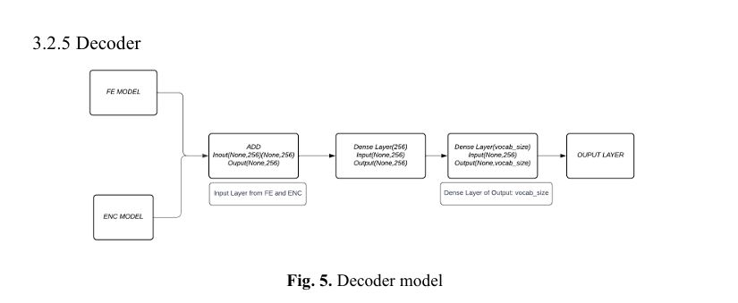

We used the Flicker8k Dataset, which can be found [here](https://github.com/jbrownlee/Datasets/releases/tag/Flickr8k). The Flicker8k Dataset contains 8,000 images, each accompanied by five different captions, providing a rich and diverse set of examples for training image captioning models.

To generate captions for images, we employed an encoder-decoder architecture. In this architecture, the image features are first extracted using a Convolutional Neural Network (CNN). The CNN acts as a feature extractor, capturing the essential visual details of the images. These extracted features are then used as inputs to the decoder.

The decoder is responsible for generating the textual description of the image (using ANN to predict the next word). It processes the previous text in the caption to predict the next word. Specifically, we used a Recurrent Neural Network (RNN) with Gated Recurrent Units (GRU) as the encoder. The GRU helps to manage long-term dependencies and improve the efficiency of the learning process.

To further enhance the performance, we utilized teacher forcing methods. Teacher forcing involves using the actual target word as the next input to the decoder during training, rather than using the word predicted by the model. This technique helps the model to learn more effectively by providing it with the correct context at each step during training.

**Architecture Used**

By combining these techniques, we aimed to build a robust model capable of generating accurate and coherent captions for images. The use of the Flicker8k Dataset provided a solid foundation for training, while the feature extractor (CNN), encoder-decoder architecture, GRU, and teacher forcing methods ensured that the network could learn how to caption the images correctly and efficiently.

e.g.

## References

1. B. Deepika, S. Pushpanjali Reddy, S. Gouthami Satya, K. Rushil Kumar. "Image Caption Generator." In _Proceedings of the International e-Conference on Advances in Computer Engineering and Communication Systems (ICACECS 2023)_, 2023, pp. 360-370. Atlantis Press. ISSN: 2589-4900. ISBN: 978-94-6463-314-6. [https://doi.org/10.2991/978-94-6463-314-6_35](https://doi.org/10.2991/978-94-6463-314-6_35).
